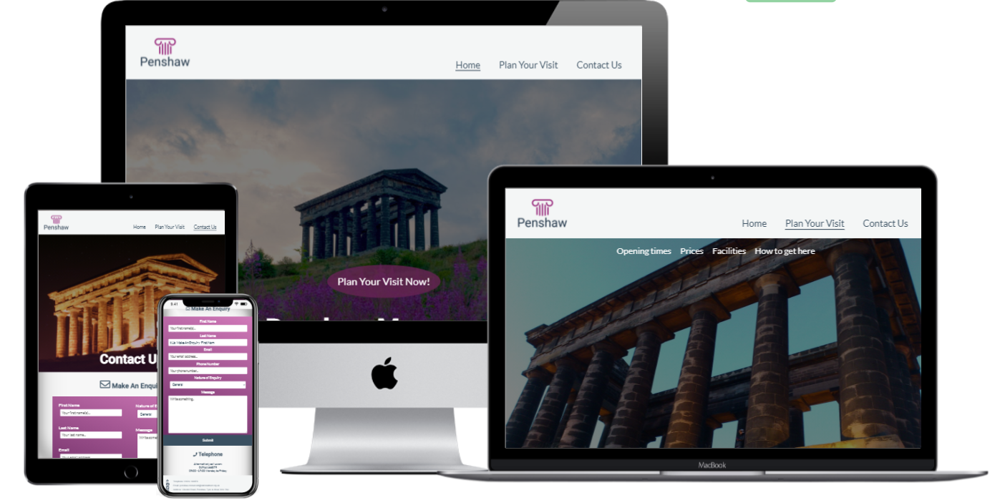
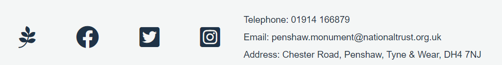

# Visit Penshaw Monument

Portfolio 1 HTML/CSS Essentials - Code Institute

Penshaw Monument is a historical landmark based in the north east of England. This site is for people interested in visiting the greek-like landmark - perhaps they have seen it up on the hill as they drive on the A1 motorway. The aim of this site is to be a reliable source of information to allow people to visit and make enquiries as desired.

 

# User Experience

## Strategy

Reasons a user may visit a site:

- A user is interested in site details such as:
    - Location of the monument
    - How to get to the monument
    - Accessibility and facilities at the monument
    - Opening times 
    - Guided tour options for the monument
    - Prices for visiting the monument

- A user may also wish to make an enquiry and find out more about:
    - Bookings
    - History of the monument
    - Ask for accessibility aids
    - General question

- A user may be interested in the history of the monument

Reasons for the site:

- Increase visitor numbers to Penshaw Monument by providing easy access to information in a minimalistic fashion

## Scope

A user can expect: 
    
  - An easy to navigate, linear site
  - Consistent header and footer
  - Responsive design for screen sizes maintaining legibility of features
  - Information on site details as described in user stories
  - Ability to contact the National Trust (owners of Penshaw Monumet) via. a submittable form or 
  - Information to contact beyond the National Trust (owners of Penshaw Monument) beyond the site.
  - Easy to find social media links for Penshaw Monument/ The National Trust

## Structure

The website will consist of three separate pages:

1. Home page complete with hero image and call to action button linking to "Plan your visit" page.
2. Plan Your Visit page complete with hero image and sections including "Opening times", "Prices", "Facilities", "How to get here".
3. Contact Us page complete with submittable form for enquiries.

## Surface

### Colours

 

- Charcoal has been used rather than black for most of the site to aid user experience, especially for those who are low vision users. Using pure black and white on websites can cause eye strain and strengthens reading stamina. More information on this can be found [here.](https://uxmovement.com/content/why-you-should-never-use-pure-black-for-text-or-backgrounds/)
- White has been used for text overlayed on images or strong background colors for better contrast, limiting eye strain and allowing for a better user experience.
- White has also been used as a background for the main body of the site. This aids contrast with the charcoal text but also maintains a minimalistic site allowing the text information to be the main focus for the user. 
- Cultured has been used to section the header and footer from the main body of the text
- Palatinate Purple has been selected from the hero-image-home.jpg using the colour picker tool. This has been used as an accent colour on the home page as well as gradienting into sky magenta for the Contact Us page form.

The colour picker used was in chrome dev tools.

The colour palette image and names were produced using coolors.co.

### Typography

I have used https://fonts.google.com/ for my fonts. Using Roboto for headings, Lato for main body text and sans-serif as back up. These are classic, easily legible fonts.
To achieve this I imported the following to the top of my style.css file.

    @import url('https://fonts.googleapis.com/css2?family=Lato&family=Roboto:wght@500&display=swap');

### Call to action

All hyperlinked text has a dotted line when hovered over. This is white when the link text is white or charcoal when the link text is charcoal. This applies to:
- Navigation bar on every page
- Home page "Plan Your Visit Now!" button
- Page navigation on "Plan Your Visit" page
- In-text hyperlink on "Plan Your Visit" page in the "Prices section" with text stating "National trust members". This is an external link to the National Trust site.

The navigation bar also has an underline to show the active page.

### Imagery

The logo for this site was produced using freelogodesign.org. It has a transparent background allowing it to take the colour of the navigation bar, blending seamlessly into the site. 

Fontawesome.com has been used for icons throughout the site. 

The three images of Penshaw Monument were found online.

1. Home page image: Title - Penshaw Monument, Artist - Tim Withnall, Copyright - [Tim Withnall](www.timwithnall.com), [flickr](https://www.flickr.com/photos/timwithnall/43553627971)
2. Plan Your Visit page image:  Artist - Dean Robson, [Pixabay](https://pixabay.com/photos/monument-penshaw-pillars-columns-86034/)
3. Contact Us page image: Artist - Mark Bryan, [freeimages](https://www.freeimages.com/photo/penshaw-monument-by-night-1521077)

## Skeleton

Wireframes were made using Balsamiq. They are for the desktop version however the design has been made responsive for smaller devices. 

Differences for smaller screen sizes:

- Navigation bar is vertically listed (in a column)
- Footer social media icons are vertically listed (in a column)
- The form on the contact us page is the whole width and in a single column
- Font-sizes and max-widths altered for different screen-sizes to maintain legibility of the text
- For larger screen sizes (above 2400px), the site will be centred in the middle of the screen with white margins
- The hero image has been sized based on the viewing height

## Features 

### Existing Features

__Navigation Bar__

  - Featured on all three pages, the full responsive navigation bar includes links to the Home page, Plan Your Visit and Contact Us page. It is identical across all pages to allow for easy, consistent navigation.
  - This section will allow the user to easily navigate from page to page across all devices without having to revert back to the previous page via the ‘back’ button. 
  - As previously mentioned, the navigation bar has an underline for the active page and when the user hovers over another navigation link, a dotted line appears.
  - The logo is linked to the home page, so the user can click that at any time to return to the home page. 

__Home Hero Image and Call To Action__

  - The first image seen when accessing the page is of the historical landmark itself so should be instantly recognisable to site visitors. Overlayed at the bottom is a large title stating the name of the landmark, Penshaw Monument so the user knows what the site is about. The image has a darkened gradient over it to contrast with the white text.
  - There is a call to action button directing people to the Plan Your Visit page as in accordance with the user stories, this is likely to be the place users want to access as it contains all the practical information for visiting. The button is in the accent colour taken from the image to maintain a common colour scheme across the site. The button also has the dotted underline on hover effect so the user knows when they are about to click it. 

__Home Blurb__

  - This section contains a fact about the landmark and highlights a reason to visit: for the stunning views.  

__The Footer__ 

  - The footer section includes links to the relevant social media sites for The National Trust/ Penshaw Monument. The links will open to a new tab to allow easy navigation for the user. 
  - The footer section also contains contact information including address, email and telephone number.

__Plan Your Visit__

  - This page also has a different hero image of Penshaw Monument with the title of the page overlayed in large white text for consistency. 
  - The Plan Your Visit page is full of all the practical information a user may need for planning a visit to Penshaw Monument. It contains all the information as suggested in the user stories: Opening Times, Prices, Facilities, How to get here. 
  - As this page is long, there is a small page navigation bar at the top of the page that links to the relevant section.
  - How to get here contains a google map iframe on the correct location for ease of planning a visit: a goal of the site. 
  - The Prices section contains an external link to the National Trust joining page. It also has the dotted underline on hover effect and opens in a new tab.
  
__Contact Us__

  - This page also has a different hero image of Penshaw Monument with the title of the page overlayed in large white text for consistency. The image has a slight purple gradient over it to tie into the color scheme and remove some of the harsh black colour from the image. 
  - This page contains a form to allow the user to make an enquiry. The form is has email and message as a requirement only. 
  - It also captures enquirer data should they choose to input it.
  - There is a pattern in the Phone Number section input targeted at UK phone numbers. However as the field is not required, it should not prevent users from around the globe from using the form.  
  - There is also a drop down list allowing the user to select the nature of their enquiry. 
  - When clicking on an input field, it turns from white to the Cultured colour.
  - Each input field contains placeholder text giving guidance on the data expected there.
  - The Submit button is charcoal to stand out from the Palantinate Purple to Sky Magenta gradient form background. 
  - Underneath the form is an alternative contact method with an easily recognisable icon.

## Features Left to Implement

- A page containing a historical time line of the site including images and facts.
- Add "top" links on the Plan Your Visit page to take the user back to the navigation bar

# Testing 

The website has been tested using Chrome Tools as well as [a testing site](http://whatismyscreenresolution.net/multi-screen-test) for responsive design. On large devicesabove 2400px, the site is centered in the middle of the page with extensive margins. 

Every internal link in the site was tested to ensure it took the user to the correct location. The hover effect is also observed on the navigation links and the "Plan Your Visit Now!" button. 

Links to external sites such as social media links all take the user to the relevant social media for either Penshaw Monument itself or the National Trust (owners of the monument) social media. A nested external link to National Trust membership contained with the Prices section of the Plan Your Visit page also takes the user to the correct location. All of these links open in a new tab. The hover effect is also observed on the nested external link.

The main user story was to access information on how to visit Penshaw Monument easily. This design meets that criteria as there are two links to the Plan Your Visit page on the home page: the navigation bar and the call to action button. 

When reaching the Plan Your Visit page, there is a second navigation bar allowing the user to skip to the part of information they wish to know. These navigation links successfully take the user to the correct location on the page. This enables the user to access the information relevant to them quickly and easily meeting the main user story need. The Plan Your Visit page also includes a google map iframe which displays correctly at the correct location and maintains functionality. 

The google maps iframe is sized for various screen sizes and maintains usability (tested on my person mobile (Pixel 3a) as well as my desktop). The map also is targeted at Penshaw Monument.

The second user story was to be able to make an enquiry and contact the Penshaw Monument staff. To meet this need:
- The footer (accessible on every page) includes: the address, phone number and email address 
- The Contact Us page is easily accessible from every page as it is part of the navigation bar. 
- The Contact Us page form was tested:
  - Using the Code Institute form dump and does submit successfully with each value against the correct input name.
  - The requirement field for email works ensures the user must submit a valid email address else the form will not submit.
  - The requirement field for message ensures the user must submit some text into their enquiry else the form will not submit. 
  - The pattern criteria on the telephone number is correct for UK phone numbers as this is where the use case is. If a user does not have a valid phone number, it is not a requirement for using the form so should not limit form use. 
- Underneath the form is an alternative form of contact with a telephone number listed along with opening times for the phone lines to offer the user another opportunity to get in touch with their preferred method. 

For users interested in the history of the site, they may include an enquiry on the Contact Us form. This need would be better with the future feature of a history page copmplete with timeline. 

The entire website was tested using a [chrome extension](https://chrome.google.com/webstore/detail/lets-get-color-blind/bkdgdianpkfahpkmphgehigalpighjck/related?hl=en) to ensure it is legible for those with different types of colour blindness. Whilst the accent colour varied a lot, all text was still legible due to the white text overlayed. 

## Validator Testing 

- HTML
  - Two errors were identified when passing through the W3C validator however these have now been fixed.  
  No further errors were returned when passing through the official [W3C validator](https://validator.w3.org/nu/?doc=https%3A%2F%2F8000-emerald-gamefowl-sudsy2iu.ws-eu09.gitpod.io%2Findex.html)
- CSS
  - No errors were found when passing through the official [(Jigsaw) validator](https://jigsaw.w3.org/css-validator/validator?uri=https%3A%2F%2F8000-emerald-gamefowl-sudsy2iu.ws-eu09.gitpod.io%2Findex.html&profile=css3svg&usermedium=all&warning=1&vextwarning=&lang=en)

## Unfixed Bugs

None presently identified.

# Deployment

- The site was deployed to GitHub pages. The steps to deploy are as follows: 
  - In the GitHub repository, navigate to the Settings tab 
  - Navigate down the sidebar to the Pages tab
  - From the Source section drop-down menu, select the Master Branch
  - Then press save, the page will be automatically refreshed with a detailed ribbon display to indicate the successful deployment. 

The live link can be found here - https://mmoore483.github.io/visit-penshaw-monument-p1/

When changes are made to the site using GitHub, the git push command will automatically update the deployed site.

## Forking

To trial changes to the site without affecting the original, the GitHub Repository can be forked.

- Log into GitHub and locate the desired repository
- In the top right, click the Fork button.

## Cloning

[Cloning](https://docs.github.com/en/github/creating-cloning-and-archiving-repositories/cloning-a-repository-from-github/cloning-a-repository) is useful for a multitude of reasons: to contribute to a project, to trial changes, to fix merge conflicts, add or remove files, and push larger commits.

- Log into your GitHub then find the gitpod repository
- Click the Code button
- If cloning with HTTPS click the clipboard icon to copy the link
- Open Gitbash
- Change the current working directory to the location where you want the cloned directory to be.
- Type git clone, and then paste the URL you copied earlier.
- Press enter to create your local clone

# Credits 

- Logo created using freelogodesign.org

- Fontawesome.com has been used for icons throughout the site. 
- Home page image: Title - Penshaw Monument, Artist - Tim Withnall, Copyright - Tim Withnall www.timwithnall.com, https://www.flickr.com/photos/timwithnall/43553627971
- Plan Your Visit page image:  Artist - Dean Robson, Pixabay, https://pixabay.com/photos/monument-penshaw-pillars-columns-86034/
- Contact Us page image: Artist - Mark Bryan, freeimages, https://www.freeimages.com/photo/penshaw-monument-by-night-1521077
- Information on Plan Your Visit page and the blurb from the Home page can be found from https://www.nationaltrust.org.uk/penshaw-monument
- Brian Machari - Mentor advice, guidance, patience and tips for things to look out for throughout the project. Especially with repsonsiveness on screen sizes above 2560px 
- Matt Rudge for the Code Institute Master Template
- Balsamiq Wireframes for wireframes in the design phase
- W3C HTML Validator for testing validity of HTML
- Jigsaw CSS Validator for testing validity of CSS
- National Trust website for content and information about Penshaw Monument
- Code beautified with [freeformatter](https://www.freeformatter.com/)
- [Rem in CSS: Understanding and Using rem Units Article](https://www.sitepoint.com/understanding-and-using-rem-units-in-css/) for understanding and fontsize: 62.5% as used in style.css
- Code Insitute love running walkthrough which much of the code was inspired by as well as other resources provided by the course including [Anna's README](https://github.com/AJGreaves/portrait-artist/blob/master/README.md)
- W3C and Kevin Powell [Youtube](https://www.youtube.com/channel/UCJZv4d5rbIKd4QHMPkcABCw) for general understanding on CSS, especially flexbox and gradients.
- Pattern for input tel is from [here](https://www.html5pattern.com/Phones)
- Responsiveness tested using [whatismyscreenresolution](http://whatismyscreenresolution.net/multi-screen-test)
- Testing site for colour accessibility using Chrome extension [Let's get color blind](https://chrome.google.com/webstore/detail/lets-get-color-blind/bkdgdianpkfahpkmphgehigalpighjck/related?hl=en)

